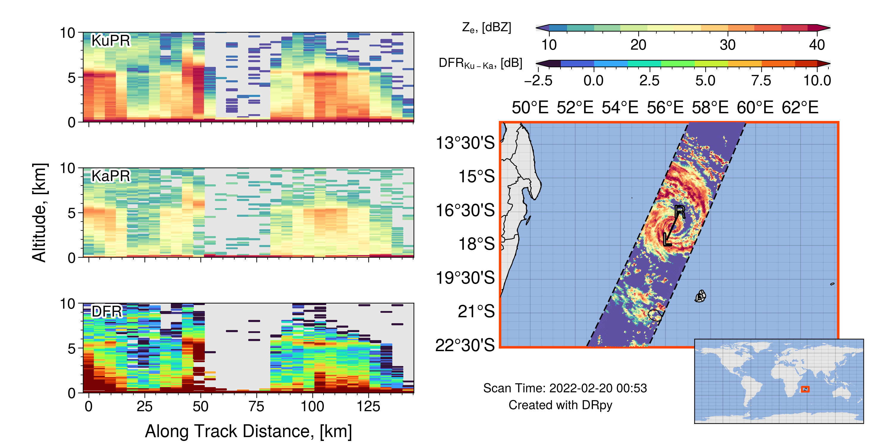
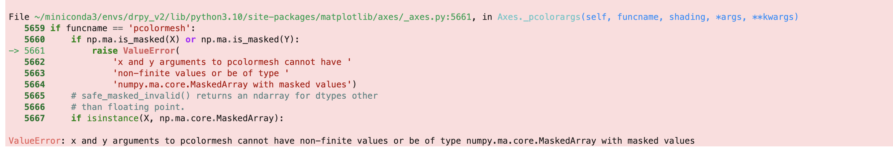

=================
Advanced Plotting
=================

Now that you have the basics of the ``DRpy`` [if you are not, please see ``Getting Started`` on the left panel], 
this page will guide you through using some of the advanced features of the ``drpy.graph.case_study`` method.
A lot of these methods will be 'trial and error', meaning try a new input to change how the plot looks, and see 
if you like the change.  

++++++++++++++++++++++++
Moving the Cross-section
++++++++++++++++++++++++

-----------------------------
Scan Adjustment (Cross-Track)
-----------------------------

.. image:: images/DRpy_case_example.png
   :align: center
   :width: 600

By default,  ``drpy.graph.case_study`` will show you the `nadir` scan of GPM-DPR which is scan 24 of 49 total.
While this works well for the image above, alot of the times, the center of the swath is not where you want to 
look. To change this, you will change the ``scan`` variable in ``drpy.graph.case_study`` like the following

.. code-block:: python

   c.plotter(scan=12)

Below I have a gif of using scan = 12 through scan = 37, which is the 'inner swath'.

.. image:: images/DRpy_raw_scanchange.gif
   :align: center
   :width: 600

Note that depending on if the orbit is 'descending' or 'ascending' the scan number might increase to the left, or increase to the right. 

-------------------------------
Length Adjustment (Along Track)
-------------------------------

In ``drpy.graph.case_study``, you can change the location of the cross-section, which is written on the map as
the 'Left' and 'Right' marker (L and R). Depending on your feature you are looking at you will want to change these. 
For example, lets look very close to the eye of this tropical cyclone. 

.. code-block:: python

   c.plotter(start_index=130,end_index=160,scan=24)

Now how about we zoom way out, say start at the first index (0 index) and go to the end (-1 index)

.. code-block:: python

   c.plotter(start_index=0,end_index=-1,scan=24)

If you use the above code, you will actually get an error. This happens because the Lat,Lon values are actually 
nans, and it screws up the distances on the x-axis of the cross-section. 

If you get an error that looks like the above picture, try increasing start_index and decreasing end_index 

.. code-block:: python

   c.plotter(start_index=25,end_index=-25,scan=24)

.. image:: images/DRpy_raw_LR3.png
   :align: center
   :width: 600

Now you have the knowledge to go ahead and play around with the GPM-DPR data!

+++++++++++++++++++++++++++
Adjusting the Cross-section
+++++++++++++++++++++++++++

While the default parameters for the cross-sections work for a number of meteorological examples, 
sometimes you want to ajust the height of the image (y-axis limit). To adjust any parameter, we will use
the params_new dictionary. 

-------
Y limit 
-------

Let's start with making the y-axis go through 15 km instead of 10, you would do the following: 

.. code-block:: python

   c.plotter(start_index=25,end_index=-25,scan=24,params_new={'y_max':15})

.. image:: images/DRpy_raw_UPDOWN.png
   :align: center
   :width: 600

-----------
Color limit 
-----------

Occasionally, we can see values of reflectivity that are lower than the default color limits (e.g., snow).
You can adjust these by sending in ``'z_vmin'`` for the lower color bound and ``'z_vmax'`` for the upper bound. 

.. code-block:: python

   c.plotter(start_index=25,end_index=-25,scan=24,params_new={'y_max':15,'z_vmin':0,'z_vmax':30})

.. image:: images/DRpy_raw_colorUPDOWN.png
   :align: center
   :width: 600

You can do the same to the DFR, by sending in ``'dfr_vmin'`` and  ``'dfr_vmax'``

.. code-block:: python

   c.plotter(start_index=25,end_index=-25,scan=24,params_new={'y_max':15,'z_vmin':0,'z_vmax':30,'dfr_vmin':-1,'dfr_vmax':5})

.. image:: images/DRpy_raw_colorUPDOWN2.png
   :align: center
   :width: 600

For this example, I hope you can see that the default color limit is probably better. 

--------------------
Different Variables 
--------------------

So far we have been looking at the 'raw' or 'measured' reflectivity at Ku- and Ka- band, as well 
as the Dual-Frequency Ratio (which is the difference between Ku and Ka). But there is a 'corrected' product 
which attempts to correct for attenuation. To change the variables that are plotted on the cross-sections 
we will use the params_new dictionary again. 

To control this, you will use the ``'xsections'`` key word. This keyword is a list of length 3, which holds
an encoded value to tell ``DRpy`` which data to plot. The raw fields are coded by even numbers: [0,2,4].

.. code-block:: python

   c.plotter(start_index=25,end_index=-25,scan=24,params_new={'xsections':[0,2,4]})

(this is the same as the default)

.. image:: images/DRpy_raw_var.png
   :align: center
   :width: 600

Now let's plot the corrected data, which uses the odd numbers: [1,3,5]

.. code-block:: python

   c.plotter(start_index=25,end_index=-25,scan=24,params_new={'xsections':[1,3,5]})

.. image:: images/DRpy_raw_var2.png
   :align: center
   :width: 600

!! NOTE NOTE NOTE !! The KaPR_c is the Ka-band reflectivity CALCULATED from the retrieved drop-size distribution. NOT 
the attenuation corrected Ka-band. This is often times why the DFR looks odd. This is not my doing, this is what the 
2A.DPR files provide.

Speaking of the retrieved drop-size distribution you can plot the retrieved rain rate! (which is nunber 8). 

.. code-block:: python

   c.plotter(start_index=25,end_index=-25,scan=24,params_new={'xsections':[1,3,8]})

.. image:: images/DRpy_raw_var3.png
   :align: center
   :width: 600
