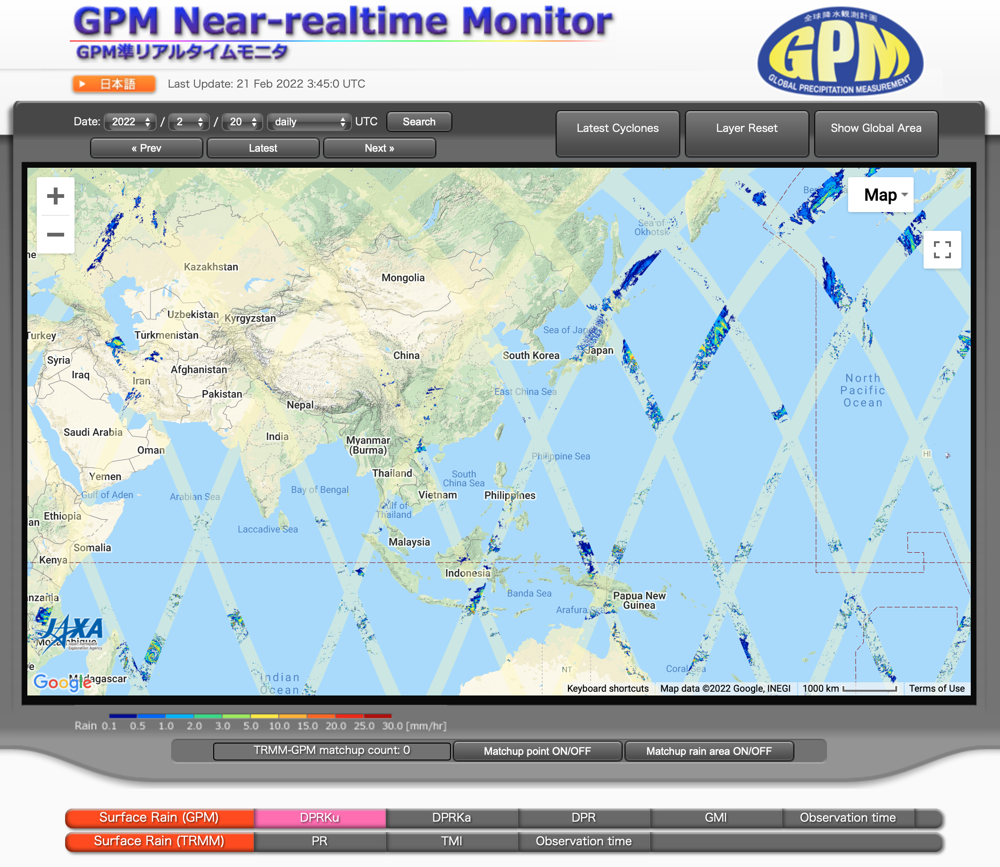
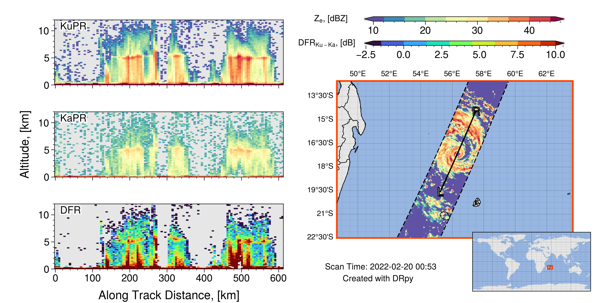
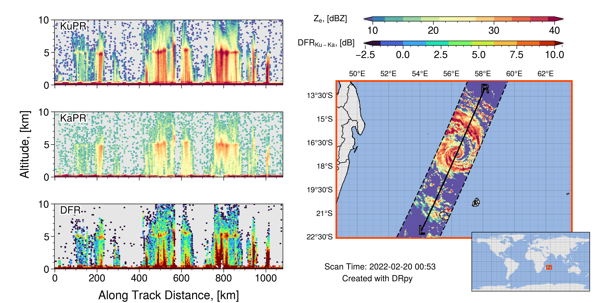

================
Getting Started
================

The main functionality of DRpy has 3 main topics: 

#. Download GPM-DPR Data 
#. Read GPM-DPR 
#. Plot GPM-DPR data 

++++++++++++++++
1. Download Data
++++++++++++++++

One of the major hurtles to using GPM-DPR data is downloading the data. Before you can do anything you have to go 
sign up to access the data server here: `PPS Registration <https://registration.pps.eosdis.nasa.gov/registration/>`_. 
Signing up is free. The purpose of it is to keep statistics of the people using the data. This is usually used at 
NASA headquarter meetings to show how valuable the GPM-DPR data are and keep the mission funded. So please go sign up. 
You also get helpful emails occasionally about data issues or satellite issues. 

Once you have signed up, you can access the ftps pages through your browser by entering the email you signed up with
as the username and the password. There are two ftp pages for GPM-DPR data: 

#. Near real time (~ 1-2 hour delay) `jsimpsonhttps.pps.eosdis.nasa.gov <https://jsimpsonhttps.pps.eosdis.nasa.gov/radar/>`_
#. Research (~ 24 hour delay). `arthurhouhttps.pps.eosdis.nasa.gov <https://arthurhouhttps.pps.eosdis.nasa.gov/gpmdata/>`_

The purpose of the two servers is to give users both a low latency option with a larger risk of the data errors and a 
day late high-quality research product. Side note, both are named after pioneers for the TRMM (`Dr. Joanne Simpson <https://en.wikipedia.org/wiki/Joanne_Simpson>`_)
and GPM (`Dr. Arthur Hou <https://gpm.nasa.gov/resources/remembering-dr-arthur-y-hou-1947-2013>`_) missions.

If you navigate to either of these servers, you will see a bunch of files with filenames that seem intially like incoherent non-sense.
Thus the first main perk of ``DRpy`` is the ability to find and download a file based on the time the data were collected. 
In the future, a planned functionality of ``DRpy`` will be able to go and grab all files that span a time range, but right now it only 
supports 1 file at a time [which is used for case study plots]. 

-----------------
Finding the time 
-----------------

The quickest method find a time and place of interesting data is to use JAXA's near-realtime website: `GPM RealTime Monitor <https://sharaku.eorc.jaxa.jp/trmm/RT3/index.html>`_
This site is amazing and provides a map of the near-surface rain rate from the GPM-DPR retrieval. 

Below is a .gif of me doing just that. Find a place that looks interesting, and turn on the "Observation Time"
toggle to locate a time and place you want to download. 

.. image:: images/findtime.gif
   :align: center
   :width: 600

This website has the near-surface rain rate for ALL of the data. So feel free to select a different day. I usually select
a date from the dropdowns rather than using the prev. next buttons because those can freeze up. 

Now that we have located a time of interest, lets actually use ``DRpy``. That brings us to the ``io`` module of ``DRpy``.
This module is tasked with scraping the text files off of the ftps servers and allowing us to grab the 1 file that matches
the time we want. 

.. code-block:: python

    import pandas as pd 
    import drpy 
    dtime = pd.to_datetime('2022/02/20 00:54:00')

    io = drpy.io.netrunner(servername='Research',username='username@email.com',start_time=dtime)

Once you run that code, it will print out the file it is downloading, like this: 

.. code-block:: console 

   Downloading: https://arthurhouhttps.pps.eosdis.nasa.gov/text/gpmdata/2022/02/20/radar/2A.GPM.DPR.V9-20211125.20220220-S003549-E020820.045337.V07A.HDF5

+++++++++++++++++++++
2. Read GPM-DPR Data
+++++++++++++++++++++

Now that you have some DPR files, here is an example of how to load them with ``DRpy``. We will use 
the core method of GPMDPR. All you need to supply is the filename/path of the file of interest and it 
will (lazily) load ALL modules of the hdf into an xarray dataset. It stores this data in ``dpr.ds``

.. code-block:: python

   dpr = drpy.core.GPMDPR(filename=io.filename[0][-64:])
   dpr.ds

if you are using Jupyter to do this, you might see something like this

.. image:: images/dataset_snap.png
   :align: center
   :width: 600

All 96 variables here are from the original hdf file. If you need more information on what each one of the variables are, please 
see the File Specificatiom (`Iguchi et al. 2021a <https://www.eorc.jaxa.jp/GPM/doc/product/format/en/03.GPM_DPR_L2_L3_Product_Format_Documentation_V7_E.pdf>`_). 
I know that this document is quite dense, so the easiest thing is probably to ctrl+f the document and search the variable you are 
curious about. In future versions of the docs, I will have more examples plotting various variables in this file. 

If you are interested in the science behind any one variable, see the Algorithm Theoretical Basis Document (ATBD, `Iguchi et al. 2021b <https://www.eorc.jaxa.jp/GPM/doc/algorithm/ATBD_DPR_V07A.pdf>`_).

++++++++++++++++++++
3. Plot GPM-DPR Data
++++++++++++++++++++

As part of ``DRpy`` I have made a fun tool that makes case study plots like the one above. To make this graph you 
need to use the graph module called ``drpy.graph.case_study()``. The ``.case_study`` method takes the filename
and the center lat/lon of the map you want to show on the right. The easiest way is to copy the lat and lon 
values from the same waypoint of the near-real-time site where you got the time. Here is an example 

.. code-block:: python

   center_lat = -17.489
   center_lon = 56.181
   c  = drpy.graph.case_study(filename=io.filename[0][-64:],center_lat=center_lat,center_lon=center_lon)

Now that the case_study object is made, you can plot it up using the default parameters like this: 

.. code-block:: python

   c.plotter()

The resulting image will look like this: 

There is added functionality to this case_study method, but this is the getting started docs page. In the future there will be 
additional docs pages to help change the default plot.